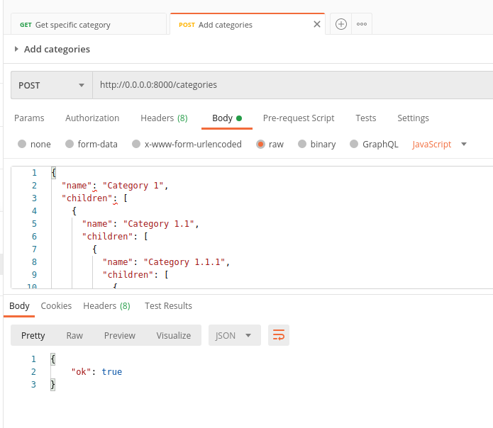

# Python Test Assignment

Create a simple Categories API that stores category tree to database and returns category parents, children and siblings by category id.



### Requirements of the assignment
- Use Python 3.4+ and Django Framework (or Django Rest Framework). 
- Use of any other third-party libraries or Django extensions (mptt, treebread, etc) is prohibited.

### Technologies used in the assignment
- Python 3.8
- Django 3.0.7
- Django Rest Framework 3.11
- Docker Compose

### Prerequisites
Docker.io and docker-compose must be installed in the system in order to be able to use the app.
OS Linux

## How to setup the application
```bash
docker-compose up
docker-compose stop
```

## How to run tests
```bash
docker-compose exec web python manage.py test
```

### API endpoints
- POST http://0.0.0.0:8000/categories
- GET http://0.0.0.0:8000/categories/9

## Additional commands at the development time
```bash
docker-compose exec web python manage.py shell
docker-compose exec web python manage.py load
```

## Contributors
@belushkin

## License
MIT License
